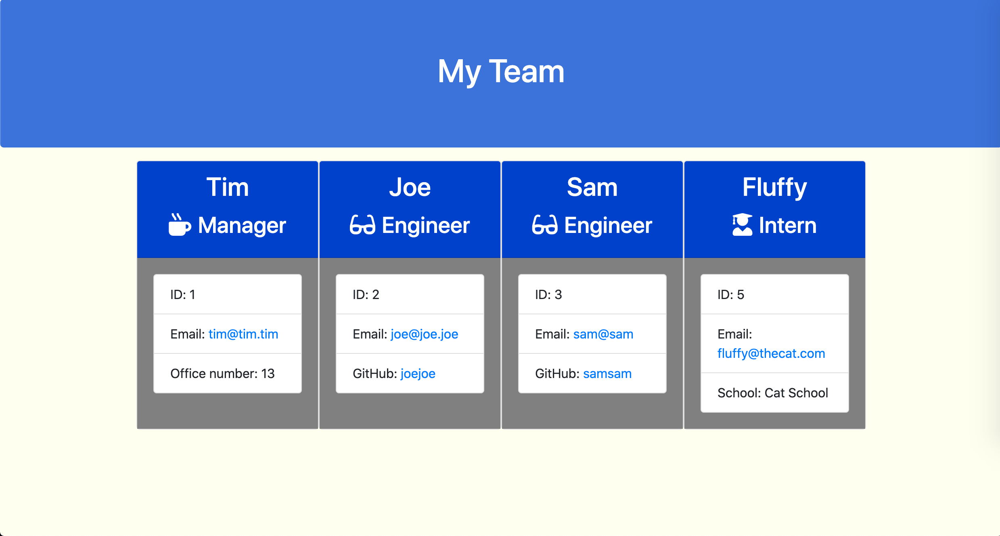

# Employee Summary Template Engine

## Table of Contents
1. [Description](#description)
2. [Installation](#installation)
3. [Usage](#usage)
4. [Contributing](#contributing)
5. [Tests](#tests)
6. [Questions](#questions)
7. [License](#license)
## Description
A Node.js CLI that dynamically generates an HTML file with employee information, based on user input. Built for the University of Washington's Web Development bootcamp, Winter 2020-2021.

## Installation
Type npm i to install dependencies (Jest for testing, Inquirer.js for CLI interaction), and you're all set.

## Usage
Type node app.js to initialize, and follow the command prompts to create Employee objects. When you're done, select Quit from the dropdown, and the HTML page will be created in the /output directory.

## Contributing
Fork at https://github.com/tmkeller/employee-summary-template-engine

## Tests
After Jest is installed with npm i, type npm test to run test suites.

## Questions
Written by [tmkeller](https://github.com/tmkeller) on Github.

Email the author at timothy.m.keller@gmail.com.

## License
[CC0](http://creativecommons.org/publicdomain/zero/1.0/)